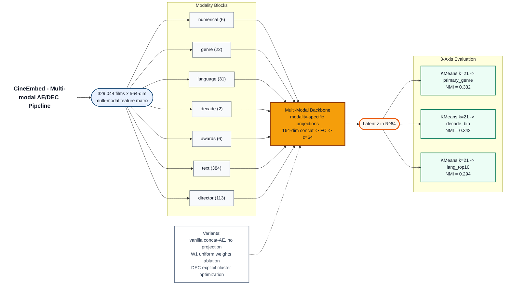

# Hero High-Level Architecture

```mermaid
graph LR
    titleNode["CineEmbed - Multi-modal AE/DEC Pipeline"]

    input(["329,044 films x 564-dim<br/>multi-modal feature matrix"])

    subgraph mods["Modality Blocks"]
        direction TB
        num["numerical (6)"]
        gen["genre (22)"]
        lang["language (31)"]
        decade["decade (2)"]
        awards["awards (6)"]
        text["text (384)"]
        director["director (113)"]
    end

    backbone["Multi-Modal Backbone<br/>modality-specific projections<br/>164-dim concat -> FC -> z=64"]
    latent(["Latent z in R^64"])

    subgraph evals["3-Axis Evaluation"]
        direction TB
        genreEval["KMeans k=21 -> primary_genre<br/>NMI = 0.332"]
        decadeEval["KMeans k=21 -> decade_bin<br/>NMI = 0.342"]
        langEval["KMeans k=21 -> lang_top10<br/>NMI = 0.294"]
    end

    variants["Variants:<br/>vanilla concat-AE, no projection<br/>W1 uniform weights ablation<br/>DEC explicit cluster optimization"]

    titleNode --> input

    input --> num
    input --> gen
    input --> lang
    input --> decade
    input --> awards
    input --> text
    input --> director

    num --> backbone
    gen --> backbone
    lang --> backbone
    decade --> backbone
    awards --> backbone
    text --> backbone
    director --> backbone

    backbone --> latent
    latent --> genreEval
    latent --> decadeEval
    latent --> langEval

    variants -.-> backbone

    classDef titleStyle fill:#ffffff,stroke:#ffffff,color:#111827,font-size:20px,font-weight:bold;
    classDef inputStyle fill:#E8F1FF,stroke:#1F4E79,stroke-width:2px,color:#111827;
    classDef modalityStyle fill:#F8FAFC,stroke:#475569,stroke-width:1px,color:#111827;
    classDef backboneStyle fill:#F59E0B,stroke:#92400E,stroke-width:3px,color:#111827;
    classDef latentStyle fill:#FFF7ED,stroke:#EA580C,stroke-width:3px,color:#111827;
    classDef evalStyle fill:#ECFDF5,stroke:#047857,stroke-width:2px,color:#111827;
    classDef variantStyle fill:#FFFFFF,stroke:#64748B,stroke-width:2px,color:#334155;

    class titleNode titleStyle;
    class input inputStyle;
    class num,gen,lang,decade,awards,text,director modalityStyle;
    class backbone backboneStyle;
    class latent latentStyle;
    class genreEval,decadeEval,langEval evalStyle;
    class variants variantStyle;
```
