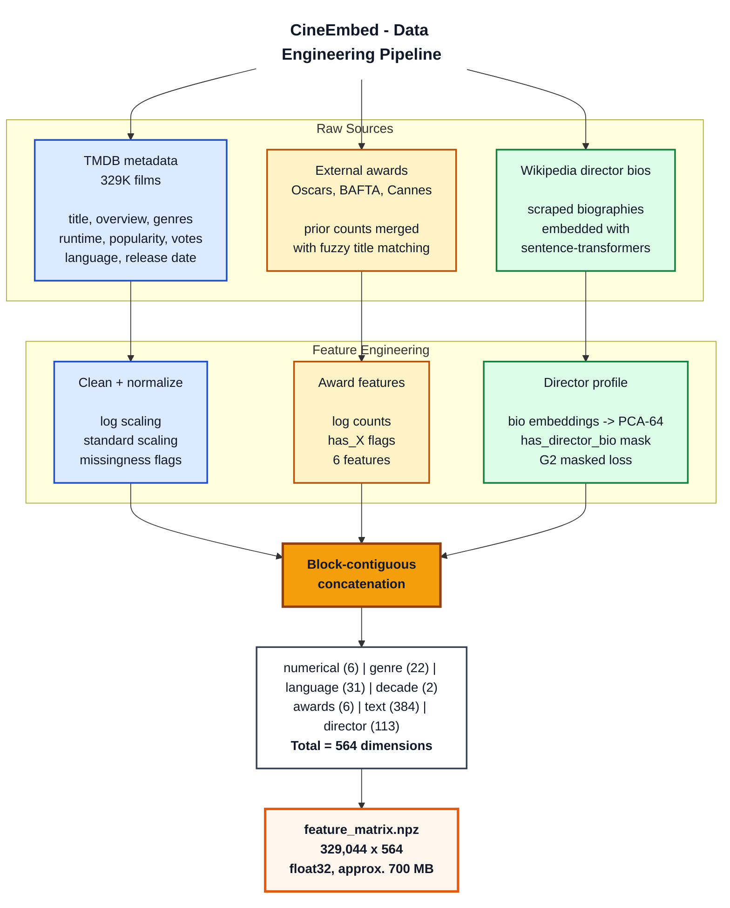

# Data Engineering Pipeline

```mermaid
graph TD
    titleNode["CineEmbed - Data Engineering Pipeline"]

    subgraph sources["Raw Sources"]
        direction LR
        tmdb["TMDB metadata<br/>329K films<br/><br/>title, overview, genres<br/>runtime, popularity, votes<br/>language, release date"]
        awards["External awards<br/>Oscars, BAFTA, Cannes<br/><br/>prior counts merged<br/>with fuzzy title matching"]
        wiki["Wikipedia director bios<br/><br/>scraped biographies<br/>embedded with<br/>sentence-transformers"]
    end

    subgraph transforms["Feature Engineering"]
        direction LR
        tmdbPrep["Clean + normalize<br/><br/>log scaling<br/>standard scaling<br/>missingness flags"]
        awardsPrep["Award features<br/><br/>log counts<br/>has_X flags<br/>6 features"]
        wikiPrep["Director profile<br/><br/>bio embeddings -> PCA-64<br/>has_director_bio mask<br/>G2 masked loss"]
    end

    concat["Block-contiguous<br/>concatenation"]

    blocks["numerical (6) | genre (22) | language (31) | decade (2)<br/>awards (6) | text (384) | director (113)<br/><b>Total = 564 dimensions</b>"]

    output["feature_matrix.npz<br/>329,044 x 564<br/>float32, approx. 700 MB"]

    titleNode --> tmdb
    titleNode --> awards
    titleNode --> wiki

    tmdb --> tmdbPrep
    awards --> awardsPrep
    wiki --> wikiPrep

    tmdbPrep --> concat
    awardsPrep --> concat
    wikiPrep --> concat

    concat --> blocks
    blocks --> output

    classDef titleStyle fill:#ffffff,stroke:#ffffff,color:#111827,font-size:20px,font-weight:bold;
    classDef tmdbStyle fill:#DBEAFE,stroke:#1D4ED8,stroke-width:2px,color:#111827;
    classDef awardStyle fill:#FEF3C7,stroke:#B45309,stroke-width:2px,color:#111827;
    classDef directorStyle fill:#DCFCE7,stroke:#15803D,stroke-width:2px,color:#111827;
    classDef processStyle fill:#F8FAFC,stroke:#475569,stroke-width:1.5px,color:#111827;
    classDef concatStyle fill:#F59E0B,stroke:#92400E,stroke-width:3px,color:#111827,font-weight:bold;
    classDef blockStyle fill:#FFFFFF,stroke:#334155,stroke-width:2px,color:#111827;
    classDef outputStyle fill:#FFF7ED,stroke:#EA580C,stroke-width:3px,color:#111827,font-weight:bold;

    class titleNode titleStyle;
    class tmdb,tmdbPrep tmdbStyle;
    class awards,awardsPrep awardStyle;
    class wiki,wikiPrep directorStyle;
    class concat concatStyle;
    class blocks blockStyle;
    class output outputStyle;
```
