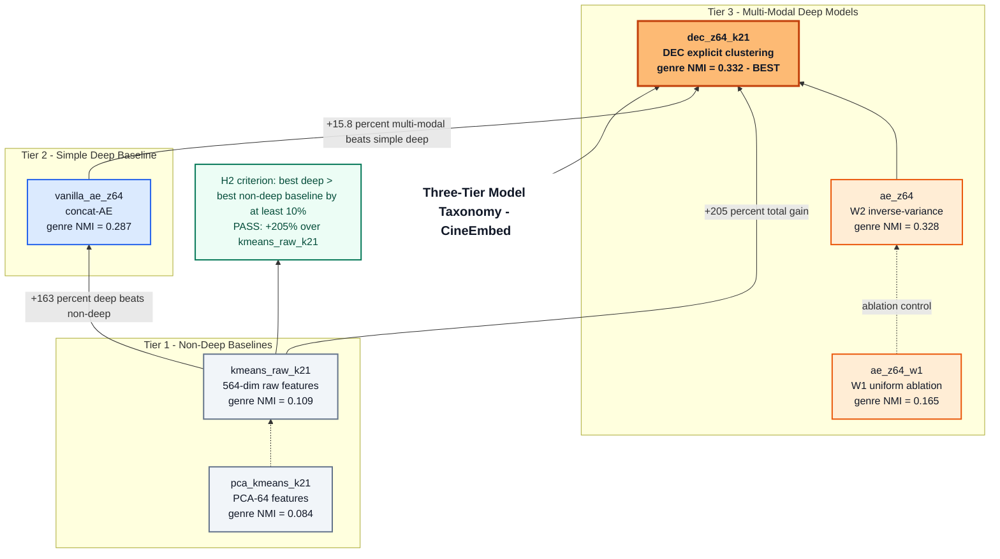

# Three-Tier Model Taxonomy

```mermaid
graph BT
    titleNode["Three-Tier Model Taxonomy - CineEmbed"]

    subgraph tier1["Tier 1 - Non-Deep Baselines"]
        direction LR
        raw["kmeans_raw_k21<br/>564-dim raw features<br/>genre NMI = 0.109"]
        pca["pca_kmeans_k21<br/>PCA-64 features<br/>genre NMI = 0.084"]
    end

    subgraph tier2["Tier 2 - Simple Deep Baseline"]
        direction LR
        vanilla["vanilla_ae_z64<br/>concat-AE<br/>genre NMI = 0.287"]
    end

    subgraph tier3["Tier 3 - Multi-Modal Deep Models"]
        direction LR
        w1["ae_z64_w1<br/>W1 uniform ablation<br/>genre NMI = 0.165"]
        ae["ae_z64<br/>W2 inverse-variance<br/>genre NMI = 0.328"]
        dec["dec_z64_k21<br/>DEC explicit clustering<br/>genre NMI = 0.332 - BEST"]
    end

    caption["H2 criterion: best deep > best non-deep baseline by at least 10%<br/>PASS: +205% over kmeans_raw_k21"]

    titleNode --> dec

    raw -->|+163 percent deep beats non-deep| vanilla
    vanilla -->|+15.8 percent multi-modal beats simple deep| dec
    raw -->|+205 percent total gain| dec

    pca -.-> raw
    w1 -.->|ablation control| ae
    ae --> dec

    raw --> caption

    classDef titleStyle fill:#FFFFFF,stroke:#FFFFFF,color:#111827,font-size:20px,font-weight:bold;
    classDef tier1Style fill:#F1F5F9,stroke:#64748B,stroke-width:2px,color:#111827;
    classDef tier2Style fill:#DBEAFE,stroke:#2563EB,stroke-width:2px,color:#111827;
    classDef tier3Style fill:#FFEDD5,stroke:#EA580C,stroke-width:2px,color:#111827;
    classDef bestStyle fill:#FDBA74,stroke:#C2410C,stroke-width:3px,color:#111827,font-weight:bold;
    classDef captionStyle fill:#ECFDF5,stroke:#047857,stroke-width:2px,color:#064E3B;

    class titleNode titleStyle;
    class raw,pca tier1Style;
    class vanilla tier2Style;
    class w1,ae tier3Style;
    class dec bestStyle;
    class caption captionStyle;
```
