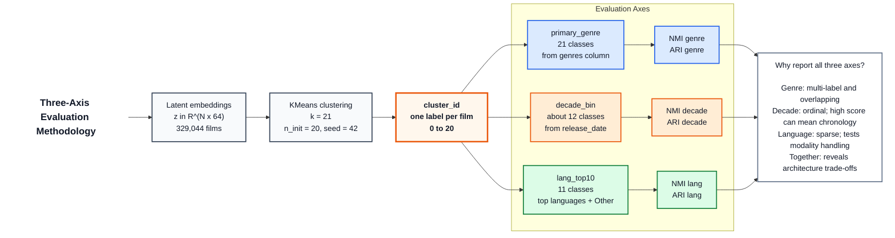

# Three-Axis Evaluation Methodology

```mermaid
graph LR
    titleNode["Three-Axis Evaluation Methodology"]

    z["Latent embeddings<br/>z in R^(N x 64)<br/>329,044 films"]
    kmeans["KMeans clustering<br/>k = 21<br/>n_init = 20, seed = 42"]
    cluster["cluster_id<br/>one label per film<br/>0 to 20"]

    subgraph axes["Evaluation Axes"]
        direction TB

        genreAxis["primary_genre<br/>21 classes<br/>from genres column"]
        genreMetrics["NMI genre<br/>ARI genre"]

        decadeAxis["decade_bin<br/>about 12 classes<br/>from release_date"]
        decadeMetrics["NMI decade<br/>ARI decade"]

        langAxis["lang_top10<br/>11 classes<br/>top languages + Other"]
        langMetrics["NMI lang<br/>ARI lang"]
    end

    why["Why report all three axes?<br/><br/>Genre: multi-label and overlapping<br/>Decade: ordinal; high score can mean chronology<br/>Language: sparse; tests modality handling<br/>Together: reveals architecture trade-offs"]

    titleNode --> z
    z --> kmeans
    kmeans --> cluster

    cluster --> genreAxis
    genreAxis --> genreMetrics

    cluster --> decadeAxis
    decadeAxis --> decadeMetrics

    cluster --> langAxis
    langAxis --> langMetrics

    genreMetrics --> why
    decadeMetrics --> why
    langMetrics --> why

    classDef titleStyle fill:#FFFFFF,stroke:#FFFFFF,color:#111827,font-size:20px,font-weight:bold;
    classDef pipelineStyle fill:#F8FAFC,stroke:#334155,stroke-width:2px,color:#111827;
    classDef clusterStyle fill:#FFF7ED,stroke:#EA580C,stroke-width:3px,color:#111827,font-weight:bold;
    classDef genreStyle fill:#DBEAFE,stroke:#2563EB,stroke-width:2px,color:#111827;
    classDef decadeStyle fill:#FFEDD5,stroke:#EA580C,stroke-width:2px,color:#111827;
    classDef langStyle fill:#DCFCE7,stroke:#15803D,stroke-width:2px,color:#111827;
    classDef whyStyle fill:#FFFFFF,stroke:#64748B,stroke-width:2px,color:#111827;

    class titleNode titleStyle;
    class z,kmeans pipelineStyle;
    class cluster clusterStyle;
    class genreAxis,genreMetrics genreStyle;
    class decadeAxis,decadeMetrics decadeStyle;
    class langAxis,langMetrics langStyle;
    class why whyStyle;
```
